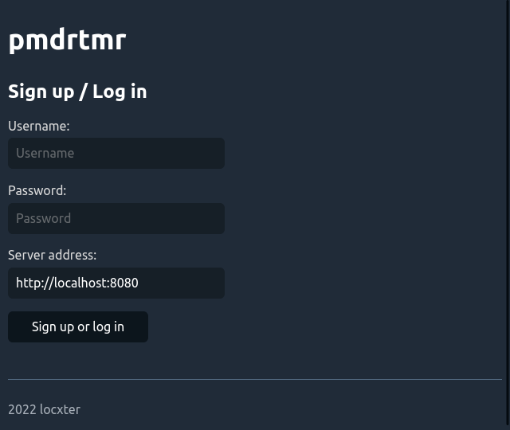

# pmdrtmr frontend

## Overview

> Please keep in mind that this way my first try at building a client-server app and is **not my primary focus** anymore.

This repository includes the frontend of my Pomodoro timer project pmdrtmr, which I build during my work placement at the [KDO](https://www.kdo.de/).

## Dependencies

I generally try to minimize dependencies, but I'm a one man crew and can therefore only support Debian-based Linux distributions as I'm running one myself. Anyway, you need to have the following packages installed for everything to work properly:

- NodeJS as the development base. Install it via the [installation guide](https://github.com/nodesource/distributions#debinstall).

## How to use it

First install the needed packages via `npm install`. Then build the program via `npm run build` and run it via `npm run start`.
